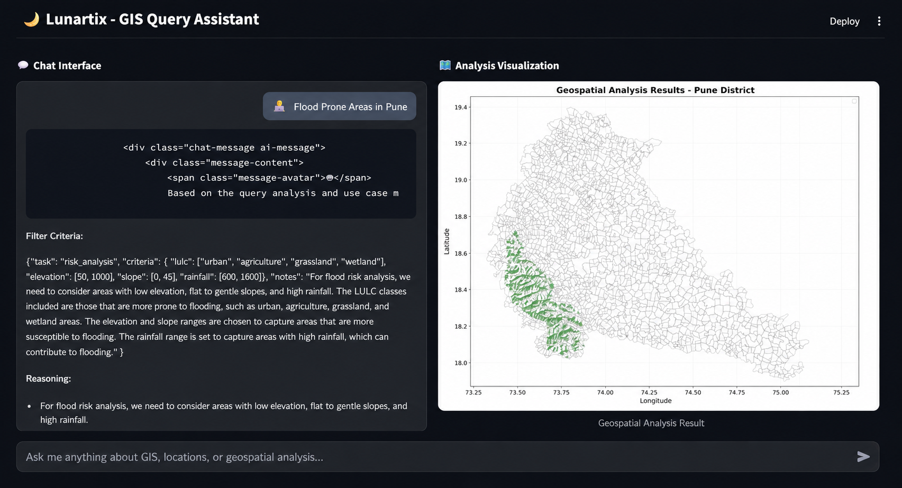

# 🌍 ISRO Geospatial AI Project: Site Suitability & Flood Mapping using LLaMA + GIS

This project demonstrates a basic geospatial reasoning system powered by AI (LLaMA 3 8B) and GIS tools like QGIS, GDAL, and GeoPandas. It enables users to make natural language queries (e.g., **“Where are flood-prone areas in Pune?”** or **“Which regions are suitable for sugarcane farming?”**), and the system performs step-by-step reasoning, executes geospatial analysis, and visualizes the results on a map.

---

## 📦 Features

- 🧠 **LLM-based Query Understanding**: Uses Meta’s [LLaMA 3](https://huggingface.co/meta-llama) model to understand and break down natural language questions.
- 🗺️ **Automated GIS Workflows**: Converts LLM reasoning into GIS operations (e.g., filtering based on slope, elevation, LULC).
- 📊 **Visual Outputs**: Displays results on a map and provides summary statistics and charts.
- 📍 **Region-Specific Analysis**: Built specifically for **Pune district**, Maharashtra.
- 🛠️ **Modular Architecture**: Easily extendable to other locations or new query types.

---
## Demo

## 📁 Required Data

The following datasets are needed (preferably clipped to **Pune district**):

1. **Elevation (DEM)**
   - Source: [USGS EarthExplorer](https://earthexplorer.usgs.gov/) or [Bhuvan NRSC](https://bhuvan.nrsc.gov.in)
   - Format: GeoTIFF

2. **Slope**
   - Derived from Elevation using QGIS or GDAL.

3. **Rainfall**
   - Source: IMD (India Meteorological Department) or ISRO Bhuvan portal

4. **Land Use / Land Cover (LULC)**
   - Source: [Bhuvan LULC Datasets](https://bhuvan.nrsc.gov.in/data/download/index.php)
   - Format: Raster or classified TIFF

5. **River Network**
   - Source: Bhuvan Hydrology Layer or OpenStreetMap (OSM)

6. **Village Boundaries**
   - Source: Pune District Portal, NIC, or manually digitized from Census shapefiles

7. **Highways/Roads**
   - Source: OSM, Bhuvan, or Maharashtra State GIS Portal

> 📌 All datasets must be in the **same CRS (Coordinate Reference System)** — typically EPSG:4326 or EPSG:32643.

---

## 🧠 LLaMA Model

- This project uses the **LLaMA 3 8B** model for natural language reasoning.
- You can download and use it through [Hugging Face](https://huggingface.co/meta-llama) (requires appropriate access).
- Run locally using [`llama.cpp`](https://github.com/ggerganov/llama.cpp) or load it with `transformers`.

---

## 🚀 How It Works

1. User inputs a query (e.g., _"Find flood-prone zones"_).
2. LLaMA model generates step-by-step reasoning and filters (e.g., low elevation, near rivers, high rainfall).
3. These criteria are applied on geospatial layers using Python libraries (`rasterio`, `geopandas`, `matplotlib`).
4. Output is visualized on a map with relevant villages/zones highlighted.

---

## 🧪 Technologies Used

- **Python**: Core scripting
- **QGIS**: Preprocessing and manual inspection
- **GeoPandas / Rasterio / GDAL**: Geospatial operations
- **Matplotlib / Seaborn**: Visualization
- **LLaMA 3 (Meta AI)**: Natural Language Reasoning
- **Streamlit (optional)**: Web interface

---

## ⚠️ Limitations

- 📍 Limited to **Pune district** – generalization to other districts requires manual setup.
- 🤖 No live model inference or cloud deployment (runs locally).
- 🗣️ LLM does **not actually run spatial operations**; it only generates reasoning steps (Chain-of-Thought) which are interpreted in Python.

